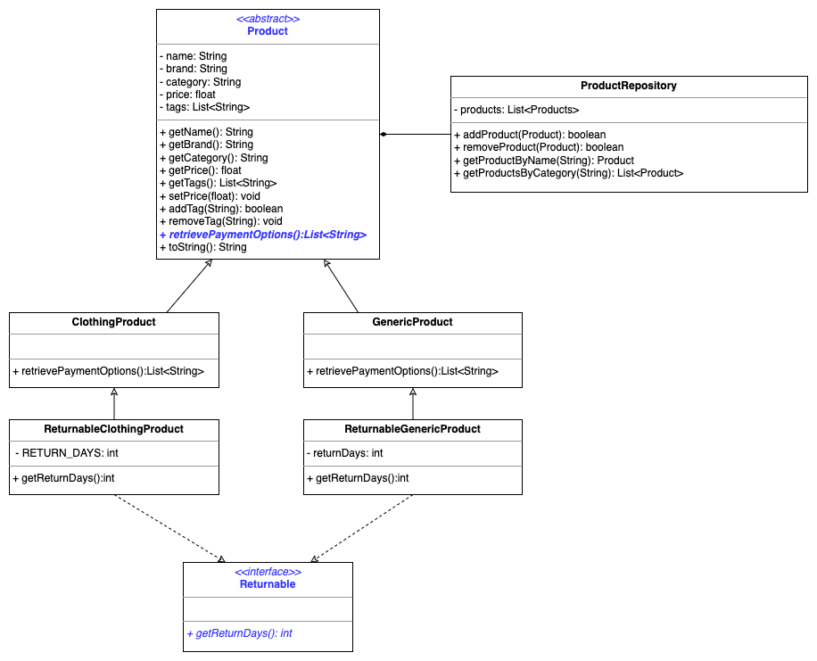
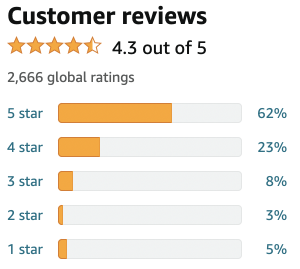

# [Class 08 - OOP Recap](https://redi-school.github.io/intermediate-java/08-oop-recap)

## Description

Let's create an e-commerce system. Think about a website like Amazon, where you can sell lots of different products :) 

### Class Diagram

Please consider the followings in the class diagram:
- the `Product` class is an abstract class; the method in blue italic is the abstract one
- `Returnable` is an interface, all of its method are abstract;
- the `ReturnableClothingProduct` has a property in UNDER_SCORE notation, which is
- the convention for constant values, declared as `private` and `final`

## Tasks

To get started, in the package `com.redi.j2`, create a class to represent a `Product`. Then go ahead

### Step 1 - Properties
Add the following private properties to the `Product`
1. `String name` the name of the product;
2. `String brand` the brand of the product;
3. `String category` the one category the product is assigned to (eg. "books", "electronics", "toys", etc.);
4. `float price` the unit price of this product;
5. `List<String> tags` a list of labels that can be assigned to a product, (eg. "new", "discount", "free-delivery", etc.);

### Step 2 - Constructor
Add a constructor that receives the `name`, `brand`, `category` and `price`.
1. The constructor should initialize the tags as an empty List
2. There should not be any other constructors in this class

### Step 3 - Getters & Setters
Implement:
1. getters for `name`, `brand`, `category` and `price`;

### Step 4 - Behaviours
Add the following behaviours to the `Product` class, which are based on the properties you created on step 1
1. `void setPrice(float newPrice)`: Changes the price of a Product. For obvious reasons, the price cannot be set to a negative value.
2. `void addTag(String tag)`: Adds a tag to the list. It should not allow duplicates.
3. `boolean hasTag(String tag)`: Return `true` if the product has this tag, `false` otherwise.
4. `void removeTag(String tag)`: Removes the given tag from the list (if exists).
5. `String toString()`: Returns a nice string representing all attributes from the product

### Step 5 - Abstract Method
Now we will create an abstract method inside the Product class:

1. Add the signature of an abstract method called `retrievePaymentOptions()` that receives no argument and return a List
       of Strings;

### Step 6 - Product subclasses
Create the following subclasses of Product in the package `com.redi.j2`:
1. `ClothingProduct` that extends Product and implements its abstract method by returning a List containing "TryNowPayLater" and "PayNow";
2. `GenericProduct` that extends Product and implements its abstract method by returning a List containing "PayNow";

### Step 7 - Returnable interface
Create an interface called Returnable in the package `com.redi.j2` that:
1. has the signature of a method `getReturnDays()` that accepts no argument and return an int;

### Step 8 - Implement the interface 
Create a ReturnableClothingProduct in the package `com.redi.j2` that
1. extends the `ClothingProduct`;
2. has a private constant property `RETURN_DAYS` of type `int` (declare it as `private final int RETURN_DAYS=30`)
3. Implements the `getReturnDays()` returning the constant value
4. override the `toString()` method to append the String `"The item is returnable within " + RETURN_DAYS + "days"`
       (hint: use `super.toString()` to retrieve the toString of the superclass ClothingProduct)

### Step 9 - Implement the interface again
Create a ReturnableGenericProduct in the package `com.redi.j2` that
1. extends the `GenericProduct`;
2. has a private property `returnDays`of type `int`
3. has a constructor that receives the `name`, `brand`, `category`, `price` and `returnDays` (hint use `super()` with
       the proper list of arguments to call the constructor of the superclass);
4. Implements the `getReturnDays()` method as a getter of the property above;
5. override the `toString()` method to append the String `"The item is returnable within " + returnDays + " days"`

### Step 10 - Create the ProductRepository
Now create a new class in the package `com.redi.j2` called `ProductRepository`, which has these properties and behaviours:
1. `List<Product> products`: The private list of abstract products, initialized by default to an empty list.
2. `ProductRepository()`: A no-args constructor.
3. `void addProduct(Product p)`: Adds a product to the ProductRepository. The method should not allow duplicates (a product with same `name` and `brand` - 
hint: override the `equals()` method in the `Product`).
4. `void removeProduct(Product p)`: Removes the specified product from the ProductRepository.
5. `Product getProduct(String name, String brand)`: Searches for a product with the referred name and brand and returns it. If not found, it returns `null`.
6. `List<Product> getProductsByCategory(String tag)`: Searches for all products from a specified category. Returns an empty list if no product matched the criteria.

## Want to know more?

If all your tests are passing, from the `Main` class, it is now time to play around with our market place 
Here is something you can experiment:
1. Create an instance of the `ProductRepository` class
2. Create ten instances of the `Product` class, each one with a representation of a different product you want to sell, and using different tags for any of them
   1. two `ClothingProduct`;
   2. two `GenericProduct`;
   3. two `ReturnableClothingProduct`;
   4. two `ReturnableGenericProduct` with 180 days as returnDays;
   5. two `ReturnableGenericProduct` with 90 days as returnDays;
3. Add these products to the ProductRepository
4. Use the ProductRepository instance to search for one of the products by name, then use the result to print the product information 
5. Use the ProductRepository instance to search for a list of matching products by a specific tag, then print them out.

## Want a Challenge? (Optional)
Implement a rating mechanism like the "[Star Classification](https://en.wikipedia.org/wiki/Star_(classification))".

- Use whatever private properties you think it will be necessary to implement all the following behaviours
- `void addRating(int stars)`: Used for adding a rating from a customer. It receives a star rating from 0 to 5 (only).
- `int getAmountRatings()`: Returns the total amount of ratings given to this product.
- `int getAmountRatings(int stars)`: Returns the total amount of ratings of a specific star (eg. how many customers gave 4 stars for this product). The method should return 0 if an invalid rating is specified.
- `float getAverageRating()`: Returns the average of all given ratings for the product. If there are no ratings, it should return -1.
- Change the `toString` method to include now these new pieces of information (`amountRatings` and `averageRating`).
- Change the `getProductsByCategory` method to return a list ordered by average ratings (the products with higher rating appear first in the result list).

